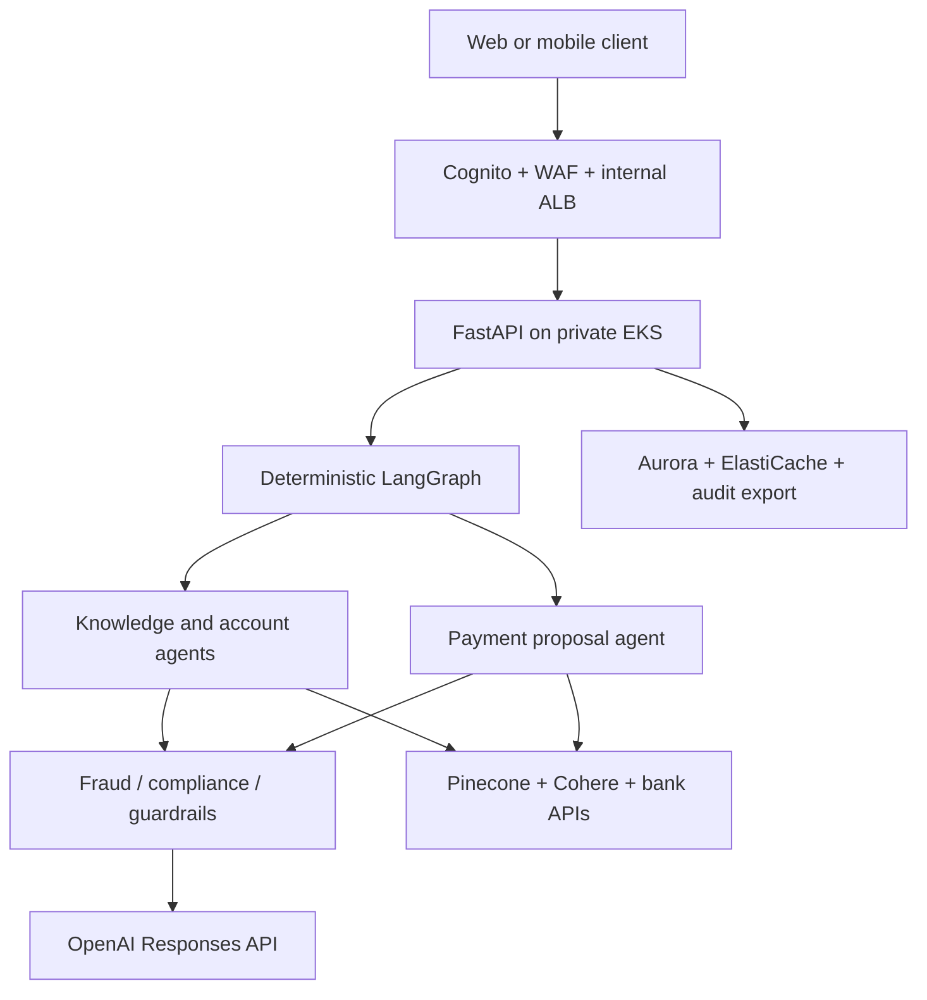
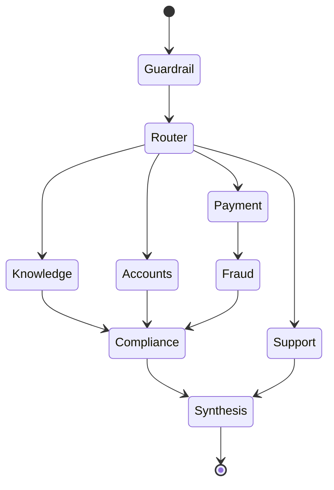

# Retail Bank Agent-to-Agent Platform

An auditable, production-oriented multi-agent reference implementation for retail banking. It uses
a deterministic LangGraph state machine, OpenAI Responses API, Pinecone retrieval, Cohere
reranking, PostgreSQL approvals/audit, Redis rate limiting, and a private AWS EKS deployment.

> This repository is deployable infrastructure and application code, but no generic repository can
> be certified for a real bank without the bank's identity model, canonical API contracts, fraud/AML
> services, legal review, data-residency decision, penetration testing, and operational acceptance.
> The replacement points are explicit and fail closed.

## What it implements

- Typed agent-to-agent messages with a correlation ID and append-only audit event.
- Specialized guardrail, router, knowledge, accounts, payments, fraud, compliance, and synthesis agents.
- RAG over approved PDF policies: S3 → page-aware chunks → OpenAI embeddings → Pinecone → Cohere rerank.
- Account authorization based on identity-token claims; the model cannot select arbitrary accounts.
- Payment proposal separated from execution. Execution requires scope, step-up authentication,
  expiry validation, policy approval, fraud approval, a database compare-and-set, and an idempotency key.
- FastAPI, OpenTelemetry hooks, Prometheus metrics, JSON logs, health/readiness probes, and eval cases.
- Local Docker Compose sandbox plus Helm, Terraform, private EKS, Aurora PostgreSQL, ElastiCache
  Valkey, S3 Object Lock, KMS, ECR, Secrets Manager, and GitHub Actions OIDC.

## Architecture



The model can classify, extract structured fields, and compose language. Application code owns
authorization, account allowlists, limits, risk decisions, approval state, idempotency, and all side effects.

## Agent graph



| Agent | May read | May write | Hard boundary |
|---|---|---|---|
| Guardrail | User text | Sanitized state | Blocks prompt injection and authentication secrets |
| Router | Sanitized text | Typed intent | No tools, no side effects |
| Knowledge | Approved Pinecone namespace | Evidence list | Metadata filter requires `publication_status=approved` |
| Accounts | Token-allowed account IDs | Masked account result | Cannot query an account absent from claims |
| Payments | Opaque IDs and request | Payment draft | Cannot execute a payment |
| Fraud | Payment draft | Risk code | Replace reference logic with bank fraud API |
| Compliance | Evidence and risk | Policy decision | Deterministic, versioned decision |
| Synthesis | Approved state only | Customer text | Cannot call payment API |
| Approval service | Stored approved proposal | Bank payment API | Requires step-up auth and idempotent compare-and-set |

## Repository map

```text
src/retail_bank_agents/
  agents/             lean, role-specific prompts
  api/                FastAPI contracts and routes
  domain/             typed banking models and provider ports
  graph/              LangGraph state, nodes, and fixed topology
  providers/          OpenAI, Pinecone/Cohere, bank API, Redis
  rag/                S3 PDF ingestion and deterministic chunk IDs
  repositories/       PostgreSQL payment and audit repositories
  services/           orchestration and payment approval/execution
alembic/               database migration
deploy/helm/           EKS workload chart
infra/terraform/       production AWS environment
evals/                 representative safety and task-success cases
tests/                 graph, security, payment, and ingestion tests
.github/workflows/     CI and private-runner CD with AWS OIDC
```

## Quick start

Prerequisites: Docker 26+, Python 3.12, `uv`, and provider accounts for OpenAI, Pinecone, and
Cohere. Never use production banking data in the local sandbox.

```bash
cp .env.example .env
# Set OPENAI_API_KEY, PINECONE_API_KEY, and COHERE_API_KEY.
uv sync --all-extras
uv run pytest -m "not integration and not live"
docker compose up -d postgres redis mock-bank
uv run alembic upgrade head
uv run uvicorn retail_bank_agents.main:app --reload --port 8080
```

The local identity is header-based only because `AUTH_DISABLED=true`; application startup refuses
that setting when `ENVIRONMENT=prod`.

```bash
curl -s http://localhost:8080/v1/chat \
  -H 'Content-Type: application/json' \
  -H 'X-Customer-ID: cust-001' \
  -H 'X-Accounts: acct-001' \
  -H 'X-Scopes: assistant:use accounts:read payments:create payments:approve' \
  -d '{"message":"Show balance for acct-001"}'
```

Payment proposal:

```bash
curl -s http://localhost:8080/v1/chat \
  -H 'Content-Type: application/json' \
  -H 'X-Customer-ID: cust-001' \
  -H 'X-Accounts: acct-001' \
  -H 'X-Scopes: assistant:use accounts:read payments:create payments:approve' \
  -d '{"message":"Transfer INR 1000 from acct-001 to ben-001 for monthly rent"}'
```

Copy `payment_approval_id` and explicitly approve it:

```bash
curl -s -X POST http://localhost:8080/v1/payments/PAYMENT_ID/approve \
  -H 'Content-Type: application/json' \
  -H 'X-Customer-ID: cust-001' \
  -H 'X-Accounts: acct-001' \
  -H 'X-Scopes: assistant:use accounts:read payments:create payments:approve' \
  -d '{"confirmation":"APPROVE"}'
```

## Knowledge ingestion

Create a Pinecone index with dimension `3072`, cosine distance, and the name configured in
`PINECONE_INDEX`. Upload only approved PDFs beneath the S3 `approved/` prefix. The ingest command
uses the S3 object ETag plus page/chunk content to produce repeatable vector IDs.

```bash
uv run bank-agent-ingest --prefix approved/ --segment all
```

Every vector carries `publication_status`, `customer_segment`, `document_version`, page, title,
section, and source URI. Retrieval filters status and segment before Cohere reranking. Establish a
separate maker-checker publication workflow upstream; do not let this service approve documents.

## Quality gates

```bash
make lint
make type
make test
python evals/run_evals.py --base-url http://localhost:8080
docker build -t retail-bank-a2a:local .
```

Live tests are intentionally excluded from default CI. Create a staging environment with synthetic
data, then run evals against the actual providers. Gate release on intent accuracy, citation
precision, unsafe-action rate, groundedness, latency, cost, and payment false-positive/negative rates.

## Production deployment

1. Follow [Implementation Guide](docs/IMPLEMENTATION_GUIDE.md).
2. Replace `providers/bank_api.py` contracts with the bank's sandbox OpenAPI contracts.
3. Replace the reference fraud score with the bank's real-time fraud/AML decision service.
4. Configure Cognito/custom IdP claims: `customer_id`, `accounts`, `scope`, `step_up_verified`.
5. Provision AWS with Terraform from a controlled pipeline and private network.
6. Install platform add-ons: AWS Load Balancer Controller, External Secrets Operator,
   Prometheus Operator, OpenTelemetry Collector, and policy enforcement.
7. Populate Secrets Manager outside Terraform; never commit provider keys.
8. Configure the GitHub `production` environment with required reviewers and repository variables.
9. Deploy through the self-hosted VPC runner and run smoke, integration, eval, load, and DR tests.
10. Complete model-risk, privacy, security, compliance, and operational sign-offs before traffic.

## Required production replacements

| Reference component | Replace/confirm before go-live |
|---|---|
| `scripts/mock_bank.py` | Remove from release context; integrate certified bank sandbox/production APIs |
| Reference fraud function | Real fraud, sanctions, AML, velocity, beneficiary-age, and device-risk service |
| Cognito defaults | Bank IdP, token lifetime, revocation, step-up/MFA, account entitlement claims |
| Aurora credentials | IAM database auth or managed rotation with separate migration/runtime users |
| Audit table | Stream to immutable bank audit lake/SIEM with retention and integrity controls |
| Provider endpoints | Region/data-residency, ZDR/retention, DPA, allowlisting, private connectivity if available |
| Policy version | Bank-owned rule repository and maker-checker release process |
| Limits/currencies | Product-, customer-, jurisdiction-, and channel-specific limits |
| Prompts/evals | Bank-approved prompt registry and production-like golden/adversarial dataset |

See [Architecture](docs/ARCHITECTURE.md), [Threat Model](docs/THREAT_MODEL.md), and
[Operations Runbook](docs/RUNBOOK.md) for design decisions and go-live controls.
