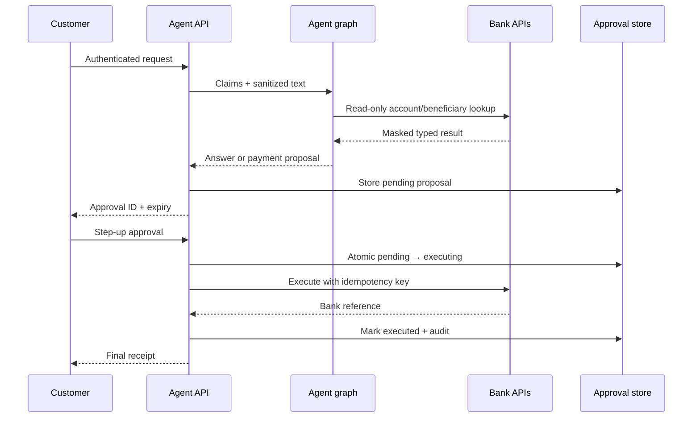
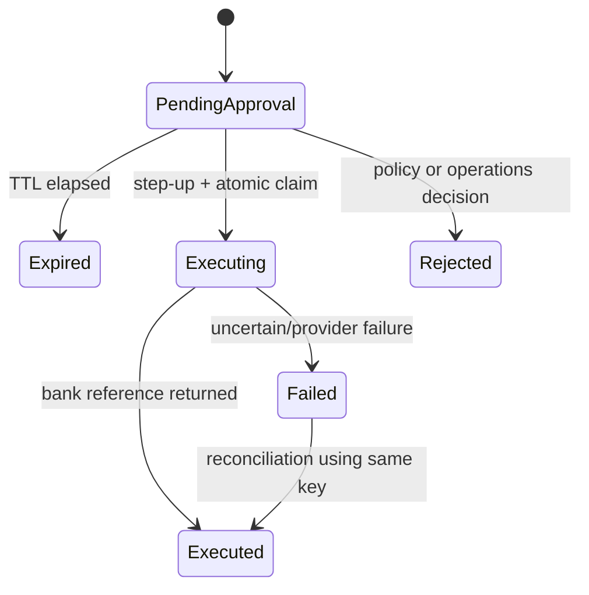

# Architecture and design decisions

## Scope

The assistant answers approved policy questions, returns masked account information, prepares a
payment proposal, and executes only after explicit step-up approval. It does not make credit,
investment, eligibility, underwriting, collections, or legal decisions.

## Why deterministic orchestration

Native provider multi-agent delegation is useful when work splits into independent research. A
retail-bank transaction needs a fixed, reviewable path with explicit policy boundaries. LangGraph
therefore owns routing and sequence; OpenAI is used inside bounded nodes. This yields replayable
state, typed messages, unit-testable decisions, and a single isolated side-effect boundary.

## Request sequence

## Trust zones

| Zone | Data allowed | Controls |
|---|---|---|
| Client/edge | Customer request and identity token | TLS, WAF, rate limits, bot controls, token validation |
| Agent API | Opaque IDs, sanitized text, masked account data | Private EKS, workload identity, network policy |
| Model provider | Minimum sanitized context | `store=false`, safety identifier, no credentials/full PAN/PIN/CVV |
| Knowledge | Approved policy text and metadata | S3 approval prefix, KMS, versioning, Pinecone namespace/filter |
| Transaction | Typed draft and policy/risk decisions | Step-up, scope, expiry, DB compare-and-set, idempotency |
| Audit | Codes and references, not raw prompts/secrets | Append-only export, Object Lock, SIEM, restricted access |

## Data minimization

- Customer IDs sent to OpenAI are HMAC pseudonyms through `safety_identifier`.
- The graph receives account IDs only from verified token claims.
- Raw user input is neither logged nor stored by application audit events.
- Full PAN, CVV, PIN, password-like values, and prompt injection are blocked/redacted before model calls.
- Account results contain only masked numbers and necessary balances.
- Model responses are generated with provider storage disabled.

## Resilience

- External reads use bounded timeouts and retries only for transient failures.
- Payment POST uses an idempotency key and at most one bounded retry.
- Database compare-and-set prevents two replicas from approving the same proposal.
- A failed execution is marked `failed`; operations reconcile it with the bank using the same
  idempotency key before any retry.
- Redis rate-limit failure closes the endpoint. Database/Redis readiness failure removes the pod.
- Three pods, three AZs, PDB, topology spread, HPA, Aurora multi-AZ, and Valkey failover are configured.

## Model routing

Default `gpt-5.6-terra` is the cost/quality balance for intent, extraction, and synthesis. Run evals
before using separate models per node. A measured route can use `gpt-5.6-luna` for high-volume intent
classification and `gpt-5.6-sol` for complex exception synthesis, but never change transactional
policy based only on a model upgrade. `OPENAI_MODEL` and reasoning effort are runtime configuration.

## Agent message contract

`AgentEnvelope` records sender, recipient, type, correlation ID, sanitized payload, and timestamp.
Payloads contain IDs and decision codes, not raw prompts or secrets. The final audit event stores the
message topology so investigators can prove which controls ran without exposing customer text.

## Payment state machine

The reference code intentionally does not auto-retry `failed` payments. Build a reconciler that
queries the bank by idempotency key and requires operations review for an uncertain outcome.

